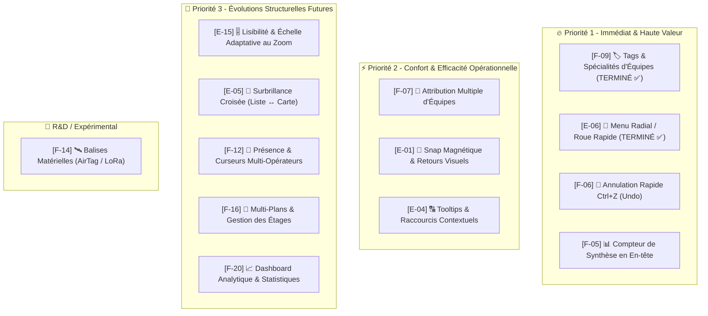

# 🗺️ Roadmap & Priorisation des Évolutions - Wheres-my-team

Ce document centralise les fonctionnalités et améliorations ergonomiques retenues, classées par niveau de priorité (**P1**, **P2**, **P3** et **R&D**), avec leur cahier des charges complet et leur plan de développement.

---

## 🧭 Vue d'Ensemble de la Matrice de Priorisation

---

# 🔴 SECTION P1 : PRIORITÉ IMMÉDIATE

---

## 1. 🏷️ [F-09] Tags & Spécialités des Équipes (Prioritaire)

### 🎯 Contexte & Besoin Métier
Lors d'un événement majeur (ex: festival 50 000+ personnes), toutes les équipes n'ont pas les mêmes compétences ni les mêmes moyens de déplacement. Le coordinateur PC doit pouvoir identifier immédiatement qui envoyer sur une intervention :
1. **🚶 Équipe terrain** (`terrain`) : Binôme standard à pied sur zone (Bleu `#3b82f6` - Cercle).
2. **🚑 Équipe volante (civière)** (`volante`) : Équipe mobile avec civière/brancard (Rouge `#ef4444` - Cercle).
3. **🛡️ Superviseur de zone** (`superviseur`) : Responsable opérationnel de secteur (Vert `#10b981` - Cercle).
4. **📻 Coordo d'événement** (`coordo`) : Super-superviseur général avec anneau contrasté (Noir `#0f172a` - Cercle).
5. **🏎️ Kart de golf / Véhicule** (`kart`) : Moyen de transport motorisé (Couleur libre - **Carré arrondi / Squircle `rounded-xl`**).

### 📐 Spécifications Fonctionnelles & UI
1. **Attribution de rôles** :
   - Sélecteur de rôle dans le formulaire d'ajout d'équipe (applique automatiquement la couleur par défaut correspondante).
   - Modification possible du rôle dans la liste et le modal de configuration.
2. **Affichage sur la Carte** :
   - Mini-badge d'icône spécifique (`Users`, `BriefcaseMedical`, `Shield`, `Radio`, `Car`).
   - Forme carrée arrondie (`rounded-xl`) pour les Karts de golf vs cercles pour les unités à pied.
3. **Filtrage dans la Barre Latérale** :
   - Puces de filtrage 1-clic en haut de la liste d'équipes (`Tous`, `Terrain`, `Volante`, `Superviseur`, `Coordo`, `Kart`).

### 💾 Données & Schéma
- Ajout du champ `specialty` ou `tags` (`text[]`) dans la table `teams` (avec fallback TypeScript propre).

### 🧪 Plan de Tests
- `teamNaming.test.ts` & `Sidebar.test.tsx` : Test de sélection de tag, affichage de l'icône associée et filtrage par spécialité.

---

## 2. 🎯 [E-06] Menu Radial / Roue d'Actions Rapides (PC & Tactile)

### 🎯 Contexte & Besoin Métier
Le clic droit actuel ouvre un menu contextuel standard. Une **roue radiale interactive** centrée sur le marqueur permet de changer le statut d'une équipe en **un seul geste fluide** (glisser-relâcher vers le quadrant du statut désiré), aussi bien à la souris sur PC qu'au doigt sur tablette tactile.

### 📐 Spécifications Fonctionnelles & UI
1. **Déclenchement** :
   - **PC** : Clic droit maintenu ou clic droit simple sur un marqueur d'équipe.
   - **Tablette/Mobile** : Appui long (500ms) sur le marqueur.
2. **Design du Menu Radial** :
   - 4 quadrants colorés autour du cercle :
     - 🟢 **Haut** : *Disponible*
     - 🔵 **Droite** : *En direction*
     - 🔴 **Bas** : *Intervention*
     - 🟡 **Gauche** : *En pause*
   - Animation d'ouverture fluide (scale + fade in 150ms).
   - Fermeture automatique au clic en dehors ou sur relâchement de la souris/doigt.
3. **Accessibilité PC** :
   - Fonctionne avec la souris (clic direct sur le quadrant ou drag-to-select).
   - Raccourcis clavier au survol du marqueur (Touches `1`, `2`, `3`, `4`).

### 🧪 Plan de Tests
- Tests unitaires Vitest de rendu du menu radial et déclenchement des callbacks de mise à jour de statut.

---

## 3. 📊 [F-05] Compteur de Synthèse Opérationnelle en En-Tête

### 🎯 Contexte & Besoin Métier
Le responsable de dispositif a besoin en un coup d'œil de savoir s'il reste des équipes disponibles en cas de nouvelle alerte majeure.

### 📐 Spécifications Fonctionnelles & UI
- Bandeau ou pastille compacte dans la barre supérieure :
  - `🟢 4 Dispos` | `🔵 2 En route` | `🔴 3 En inter` | `🟡 1 Pause`
- Clic sur une pastille = filtre automatique la liste latérale sur ce statut.

---

## 4. 🎚️ [E-15] Lisibilité & Échelle Adaptative au Zoom

### 🎯 Contexte & Besoin Métier
Lors d'un dézoom important sur l'ensemble du festival, les marqueurs et textes se chevauchent et deviennent illisibles. Lors d'un fort zoom sur une scène, les zones ou textes peuvent être démesurés.

### 📐 Spécifications Fonctionnelles & UI
1. **Échelle Adaptative (Anti-Collision)** :
   - Calcul de la taille des marqueurs en fonction de `zoomScale` :
     - Dézoom (0.5x) : Marqueurs compacts avec initiales uniquement.
     - Zoom standard (1x) : Marqueur complet avec nom et badge de statut.
     - Fort zoom (2x+) : Marqueur élargi avec description et détails.
2. **Amélioration du Rendu des Zones & Textes** :
   - Contraste dynamique du texte selon la couleur de fond de la zone (calcul luminance WCAG).
   - Tailles de police vectorielles nettes garantissant une lisibilité maximale quel que soit le niveau de zoom.

---

# 🟡 SECTION P2 : CONFORT & FLUIDITÉ OPÉRATIONNELLE

---

## 5. 🔄 [F-06] Annulation Rapide `Ctrl+Z` (Undo)
- Mémorisation d'une pile d'actions locales (déplacement d'équipe, déplacement de zone, changement de statut).
- Raccourci `Ctrl+Z` (ou `Cmd+Z` sur Mac) et bouton "Annuler" discret pour revenir instantanément à la position précédente.

## 6. 👥 [F-07] Attribution Multiple d'Équipes par Intervention
- Permettre d'assigner une équipe principale + des équipes de renfort (`assigned_team_ids: string[]`).
- Affichage visuel des liens/lignes reliant toutes les équipes mobilisées sur un même incident.

## 7. 🧲 [E-01] Retours Visuels & Haptiques au Snap
- Animation de halo pulsant lorsqu'une équipe est relâchée à proximité d'une intervention (< 4% de distance).
- Vibration haptique sur smartphone/tablette (`navigator.vibrate(50)`).

## 8. 🎯 [E-05] Surbrillance Croisée (Hover Linking)
- Survoler une équipe dans la barre latérale déclenche une pulsation lumineuse sur son marqueur sur la carte.
- Survoler un marqueur met en évidence sa ligne dans la sidebar.

## 9. 🔠 [E-04] Tooltips & Raccourcis Contextuels
- Infobulles intelligentes guidant l'utilisateur sur les gestes possibles (`Glisser pour déplacer`, `Double-clic pour créer intervention`, `Clic droit pour menu rapide`).

---

# 🔵 SECTION P3 : ÉVOLUTIONS STRUCTURELLES FUTURES

---

## 10. 👀 [F-12] Présence Multi-Opérateurs en Temps Réel
- Affichage des curseurs et avatars des autres coordinateurs connectés sur le même plan via Supabase Presence.

## 11. 🏢 [F-16] Multi-Plans & Gestion des Étages / Secteurs
- Sélecteur de niveaux (RDC, Étage 1, Zone Extérieure) au sein d'un même événement.

## 12. 📈 [F-20] Dashboard Analytique & Statistiques d'Événement
- Statistiques de durée moyenne des interventions, pics d'activité horaire et temps de réponse des unités.

---

# 🧪 SECTION R&D : LOCALISATION PHYSIQUE

---

## 13. 🛰️ [F-14] R&D Localisation Matérielle Terrains Dégradés (Festival 50k+ personnes)
- **Problématique** : Réseau 4G/5G saturé par le public, interdictions téléphones bénévoles, radios VHF non géolocalisées.
- **Pistes d'exploration matérielle** :
  1. *Réseau Mesh LoRaWAN privé* : Balises GPS autonomes sur batterie (portée 5 km sans réseau cellulaire).
  2. *Balises AirTag / SmartTag / UWB* : Expérimentation de la densité du réseau Find My en festival.
  3. *Passerelles locales Wi-Fi / Bluetooth Long Range*.
